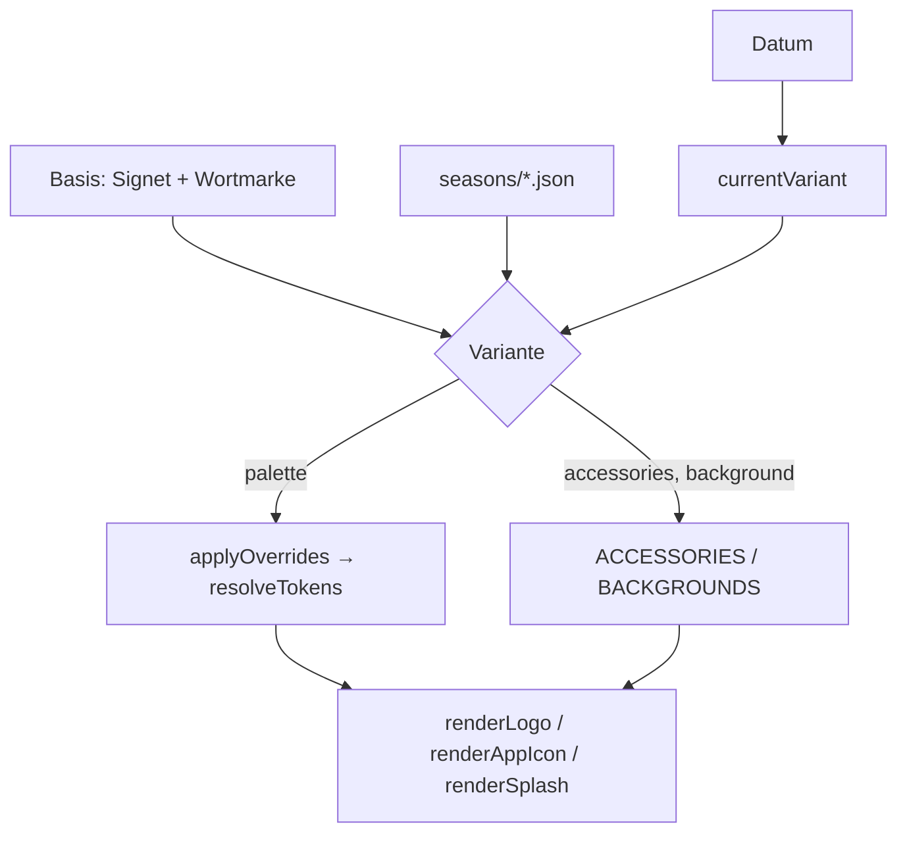

## Ebene 1 — Idee
Ein Basis-Logo (rundes Schwein-Signet mit Münze im Kopfschlitz + weiche, aus Strichen gebaute Wortmarke „piggy“
mit Münze als i-Punkt) bleibt immer gleich. Saisonale und monatliche Varianten sind **nur Daten darüber**:
Palette-Override, Accessoires (Mütze, Sonnenbrille, Schal, Fahne …), Hintergrund-Deko und Gültigkeit.
Wie bei Clash of Clans erkennt man die Marke in jeder Variante sofort.

Regeln: Monat schlägt Saison. Mehr als ein Treffer auf der entscheidenden Ebene → Basis-Logo. Kein Treffer → Basis.

**Nie:** eine Variante als eigene, kopierte Logo-Datei pflegen; Hex-Werte in Varianten statt Token-Referenzen;
die Signet-Geometrie pro Variante verändern.

## Ablauf
1. WENN jemand eine Variante braucht DANN legt er `seasons/<kind>-<name>.json` an (Schema: `variant.schema.json`).
2. WENN `build.js` läuft DANN validiert es jede Variante (`validateVariant`, Accessoire-/Hintergrund-IDs,
   Token-Overrides auflösbar, Splash-Wortmarken-Kontrast ≥ 3:1).
3. WENN valide DANN rendert es pro Variante Logo (horizontal/stacked), Signet, App-Icon, Android-Adaptive,
   Splash (Logo) und Splash-Screen als SVG und PNG, plus `@1x/@2x/@3x` für die App.
4. WENN die App ein Datum hat DANN liefert `currentVariant(date)` die gültige Variante.
5. SONST (Gleichstand, keine Variante) Basis-Logo.

## Ebene 2 — Umsetzung
- `lib/art.js` — `signetDefs()`, `earsSvg()`, `headSvg()` (Signet), `wordmarkSvg()` (Strich-Glyphen, Bounce),
  `ACCESSORIES` (19: partyHat, dominoMask, roundGlasses, receipt, bunnyEars, easterEgg, heartBalloon, swimRing,
  strawHat, swissFlag, cowBell, flowerCrown, witchHat, lantern, santaHat, sunglasses, scarf, beanie, skiGoggles),
  Flags `hidesCoin`, `earsOver`, `extendsRight`; `BACKGROUNDS` (12). `renderSignet/renderWordmark/renderLogo/
  renderAppIcon/renderSplash`.
- `lib/tokens.js` — `currentVariant()`, `inWindow()` (Fenster über Jahreswechsel), `validateVariant()`, `artColors()`.
- `seasons/` — 4 Saisons (Frühling, Sommer, Herbst, Winter/Ski) + 12 Monate (Neujahr, Fasnacht, Steuererklärung,
  Ostern, Muttertag, Badi, Sommerferien, 1. August, Alpabzug, Halloween, Räbeliechtli, Samichlaus).
- `tools/build.js` — Schritt 3/4 (Validierung, SVG, PNG via `inkscape --shell`), `dist/variants/index.json`,
  generiert `variants/variants.ts` (gleiche Resolver-Logik in TS).
- Kopplung: Resolver doppelt (JS-Lib + generiertes TS) → Parität in `tools/test.js` (transpiliert mit Piggys TypeScript).

## Akzeptanz
- [x] Basis-Logo als SVG (horizontal, stacked, Signet, Wortmarke) + PNG
- [x] 4 Saisons + 12 Monate als JSON
- [x] Alle 16 Varianten fertig gerendert (Logo, App-Icon, Adaptive, Splash) — Ziel waren mindestens 4
- [x] `currentVariant(date)`; Monat > Saison; Gleichstand → Basis; 40 Tests grün
- [x] Palette-Override pro Variante (z.B. 1. August: Nachthimmel, weisse Splash-Wortmarke)
- [ ] Bewegliche Feiertage (Ostern, Fasnacht) berechnet statt festes Fenster
- [ ] Accessoires an 3D-Maskottchen

## Idee-Historie
- 2026-09-29 — Partial angelegt; Entscheidung „Varianten als Datenschicht“ → ADR 0001
